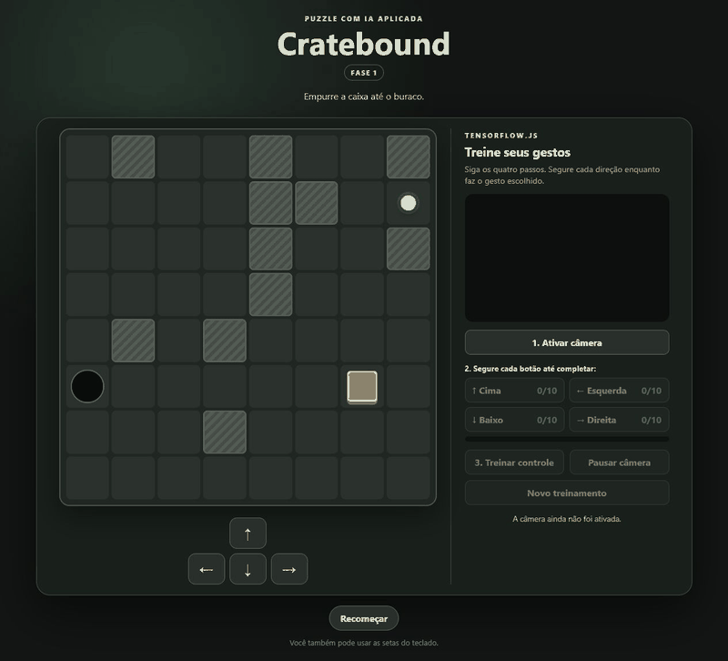
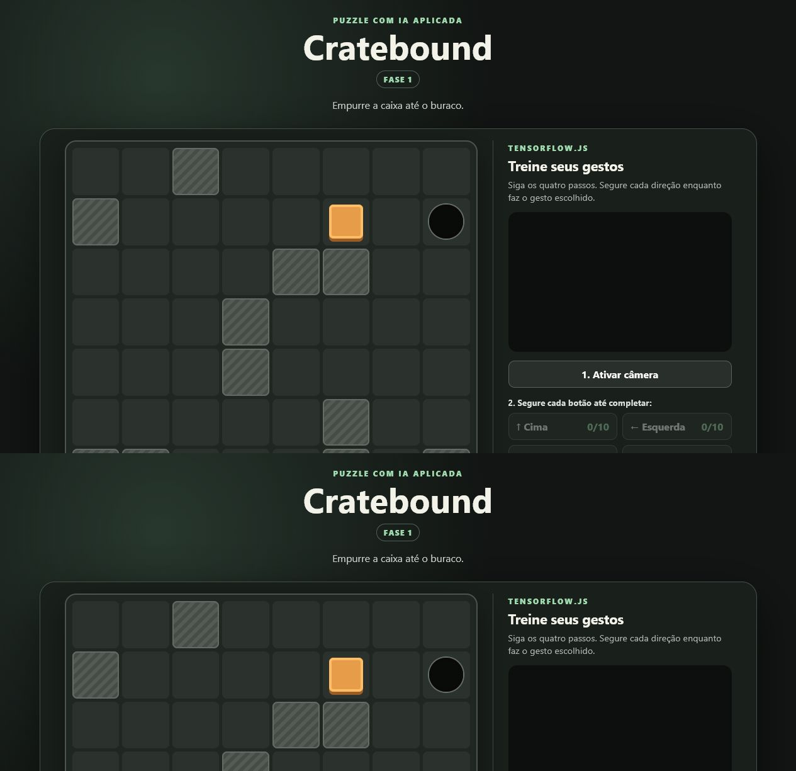
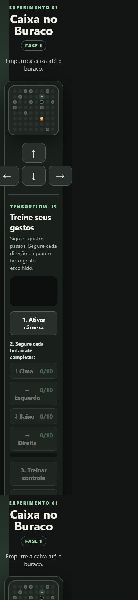
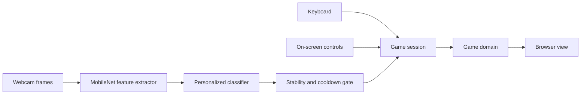

<div align="center">

# Cratebound

### Teach the gesture. Guide the crate.

[](https://github.com/claudneysessa/cratebound/actions/workflows/ci.yml)
[](https://developer.mozilla.org/docs/Web/JavaScript)
[](https://www.tensorflow.org/js)
[](#quality-engineering)
[](#run-locally)

[Play live](https://claudneysessa.github.io/cratebound/) · [Português](README.pt-BR.md) · [Architecture](docs/ARCHITECTURE.md) · [Contributing](CONTRIBUTING.md)



</div>

## Why this project exists

Artificial intelligence becomes more valuable when it is treated as an
engineering component rather than a demo effect.

**Cratebound** explores that idea through a small, visual problem: push a box
into its destination across randomly generated puzzle rooms. The game can be played
with regular input controls, then extended with a webcam-based classifier that
learns four gestures chosen by the player.

The interesting part is not only that the model works. It is that the game
rules remain independent from TensorFlow.js, the webcam, the keyboard and the
DOM. AI is one input adapter among others — not the architecture itself.

> This repository was created as an applied experiment in a postgraduate
> Software Engineering with Applied AI program.

## What makes it different

- **Personalized gesture control:** the browser learns the player's own visual
  gestures instead of relying on a fixed gesture vocabulary.
- **Transfer learning in the browser:** MobileNet extracts image features and a
  small dense classifier learns four movement classes locally.
- **Solvable procedural levels:** generated 8 × 8 rooms are accepted only after
  a search confirms that the box can reach the hole.
- **Domain-first design:** movement, collision, victory and level generation do
  not depend on browser APIs.
- **Test-driven evolution:** behavior was introduced in short
  red–green–refactor cycles and recorded in the project history.
- **Zero build step:** the modular application runs with native ES modules.

## See it in action

The animation below is an actual run of the application. The player moves into
position, pushes the box into the hole and triggers the next level.

[**Open the live HTTPS demo →**](https://claudneysessa.github.io/cratebound/)


<details>
<summary><strong>Desktop experience</strong></summary>



</details>

<details>
<summary><strong>Responsive experience</strong></summary>



</details>

## How the applied AI works

1. The player enables the webcam explicitly.
2. MobileNet v2 runs as a frozen feature extractor.
3. The player records at least ten examples for each direction.
4. A compact dense classifier is trained for 20 epochs in the browser.
5. Predictions pass through a confidence, stability and cooldown gate.
6. Accepted predictions become the same movement commands used by the keyboard
   and on-screen buttons.

Training samples and predictions stay in browser memory. This project does not
upload images to an application server.



## Engineering approach

The repository uses a deliberately small three-layer design:

| Layer | Responsibility | Browser-independent |
| --- | --- | :---: |
| `domain` | Movement, collisions, victory and solvable level generation | Yes |
| `application` | Session orchestration, progress and camera-command policy | Yes |
| `interface` | DOM rendering, keyboard/buttons and webcam integration | No |

This boundary makes the central rules fast to test and keeps TensorFlow.js from
spreading through the codebase. Read the
[architecture notes](docs/ARCHITECTURE.md) for trade-offs and design decisions.

## Quality engineering

The automated suite currently covers:

- box pushing and victory;
- room boundaries and obstacle collisions;
- solvable procedural generation;
- session reset and level progression;
- gesture-training readiness;
- prediction confidence, stability and repetition limits;
- camera-command thresholds and training readiness.

```bash
npm test
```

Expected result: **10 passing tests** using Node.js' native test runner.

Every push and pull request is checked by GitHub Actions on supported Node.js
versions.

## Run locally

Requirements:

- a modern browser;
- Node.js 20+ to run the tests;
- Python 3 or any static HTTP server to serve native ES modules.

```bash
git clone https://github.com/claudneysessa/cratebound.git
cd cratebound
python -m http.server 8765
```

Open `http://localhost:8765`.

No dependency installation or build process is required. Internet access is
needed on first load to retrieve TensorFlow.js and MobileNet from jsDelivr.
Webcam access requires an explicit browser permission and works on `localhost`
or a secure HTTPS origin.

## Train your controls

1. Select **Ativar câmera** and grant camera access.
2. Choose one distinct gesture for each direction.
3. Hold each direction button until it reaches `10/10`.
4. Select **Treinar controle** and wait for the 20 training epochs.
5. Play with your gestures; pause predictions or start a new training session
   whenever needed.

You can always fall back to the arrow keys or the on-screen controls.

## Technology stack

| Technology | Role in the project |
| --- | --- |
| [HTML5](https://developer.mozilla.org/docs/Web/HTML) | Semantic structure, controls, video and accessibility contracts |
| [CSS3](https://developer.mozilla.org/docs/Web/CSS) | Visual system and responsive layout |
| [JavaScript](https://developer.mozilla.org/docs/Web/JavaScript) | Domain, application and browser implementation with native ES Modules |
| [TensorFlow.js 4.22](https://www.tensorflow.org/js) | In-browser training and inference runtime |
| [MobileNet 2.1.1](https://github.com/tensorflow/tfjs-models/tree/master/mobilenet) | Pre-trained feature extractor used for transfer learning |
| [Node.js test runner](https://nodejs.org/api/test.html) | Dependency-free automated tests |
| [GitHub Actions](https://github.com/features/actions) | Continuous integration across supported Node.js versions |
| [GitHub Pages](https://pages.github.com/) | Free HTTPS hosting for the live application |

These technologies are third-party tools used to build and deliver the project.
The product concept, game design, source code, architecture, interface, tests
and documentation are original work authored by Claudney Sarti Sessa.

## Project structure

```text
.
├── src/
│   ├── domain/          # Pure game rules and level generation
│   ├── application/     # Use-case orchestration and input policies
│   └── interface/       # Browser and webcam adapters
├── test/                # Node.js native test suite
├── docs/                # Architecture and media
├── index.html
└── styles.css
```

## Roadmap

- Add deterministic seeds so levels can be shared and replayed.
- Persist optional gesture-training metadata without storing camera frames.
- Add keyboard-accessible configuration for prediction thresholds.
- Expand automated browser checks for the complete training workflow.
- Add model-performance feedback after each personalized training session.

## About the author

Built by **Claudney Sarti Sessa**, Systems Analyst and Information Systems
graduate, with postgraduate studies in Big Data & Analytics and Software
Engineering, currently specializing in Software Engineering with Applied AI.

[GitHub profile](https://github.com/claudneysessa)

## Authorship

**Cratebound is an original project created and developed in full by
Claudney Sarti Sessa.** It is not a clone, copy or adaptation of another game
or application. Third-party libraries and platforms are identified in the
technology stack as tools and retain their respective ownership and licenses.

---

<div align="center">
  <sub>Built to connect applied AI with maintainable software design.</sub>
</div>
