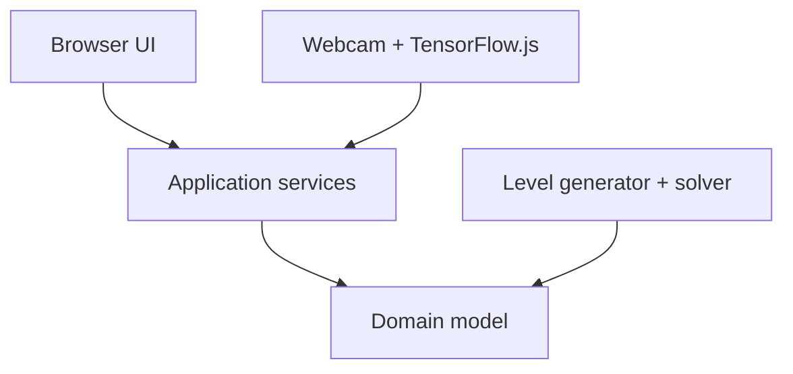
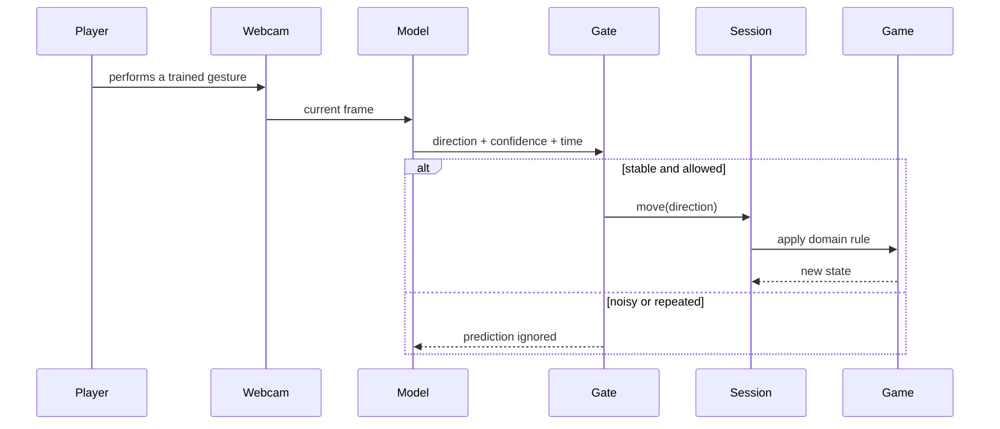

# Architecture

This document describes the boundaries and trade-offs behind **Cratebound**. It
complements the product-oriented overview in the main README.

## Design goals

The architecture was kept intentionally small. Its goals are to:

- protect game rules from browser and machine-learning concerns;
- make behavior testable without a DOM, webcam or neural-network runtime;
- support multiple input mechanisms through the same application boundary;
- keep procedural generation honest by validating solvability;
- apply SOLID and domain-driven naming proportionally to the problem.

## Dependency direction

Dependencies point inward. The domain does not import from `application` or
`interface`, and the application layer does not depend on HTML elements.

## Layers

### Domain

`src/domain/game.js` owns player and box movement, room boundaries, obstacle
collision and victory detection.

`src/domain/level-generator.js` creates candidate rooms and accepts them only
when its search can find a valid solution. A fallback layout guarantees
termination when random candidates are repeatedly rejected.

### Application

`src/application/game-session.js` coordinates a game instance, publishes state,
resets the current level and advances after victory. The level generator and
scheduler are injected, so the service is not tied to `Math.random` or browser
timers during tests.

`camera-training-progress.js` defines when the four gesture classes have enough
examples. `camera-command-gate.js` protects the game from noisy predictions by
combining confidence, consecutive agreement and cooldown rules.

### Interface

`src/interface/browser-app.js` renders state and maps keyboard, buttons and
accepted camera predictions into application commands.

`src/interface/webcam-controller.js` is the TensorFlow.js adapter. It requests
the webcam after a user action, loads MobileNet, captures labeled activations,
trains a four-class classifier and disposes replaceable tensors.

## AI boundary

The classifier never manipulates game state directly. Its output must pass
through `CameraCommandGate`, then enter `GameSession` as a regular direction.
This makes the model replaceable and keeps failure modes localized.

## Testing strategy

- Domain tests prove movement, collision, victory and solvability.
- Application tests prove orchestration and command policies.
- Delivery tests protect the standalone CodePen variant and responsive
  contracts.

The neural-network runtime is kept behind an adapter. A future end-to-end layer
can cover camera permission, training and prediction without slowing the core
suite.

## Trade-offs

### CDN-hosted ML dependencies

TensorFlow.js and MobileNet are pinned but loaded from jsDelivr. This keeps the
repository small, at the cost of requiring network access on the first load.

### In-memory training

Training examples stay in memory and disappear on reload. This supports privacy
and keeps the experiment stateless, but requires retraining in each session.

### Duplicated CodePen delivery

The `codepen` directory contains a classic JavaScript delivery in addition to
the modular source. Tests protect key parity contracts, but a generator would
reduce manual synchronization in a larger project.

### Procedural search

The generator proves that a solution exists; it does not yet rank level quality
or difficulty beyond obstacle growth. Deterministic seeds and difficulty metrics
are natural next steps.
